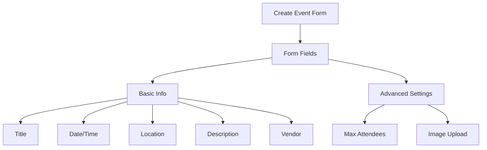
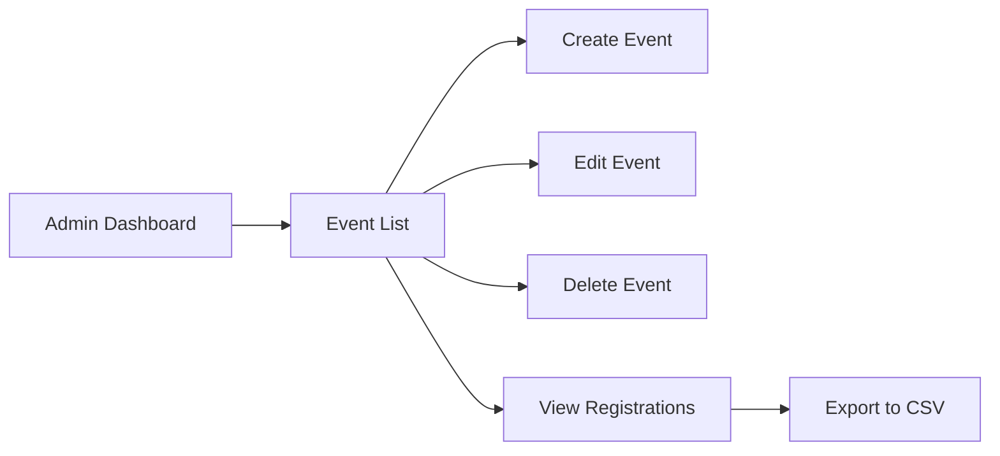

# Event Management System Improvement Plan

## Overview
This document outlines the planned improvements for the Border Trucks event management system. The goal is to create a comprehensive interface for managing events, registrations, and attendee communications.

## Current System Analysis
- Basic CRUD functionality with Firebase integration
- Limited admin features (only max attendees update)
- Mock data in EventList component
- Basic registration management

## Planned Improvements

### 1. Event Creation & Editing Interface

#### Form Fields Structure

#### Implementation Details
- Create new event form component
- Integrate existing ImageUploader component
- Add form validation
- Implement Firebase data storage
- Add success/error notifications

### 2. Event Management Dashboard

#### Feature Structure

#### Key Features
1. Event List View
   - Real-time Firebase data integration
   - Sorting options (date, title)
   - Search functionality
   - Pagination
   - Quick actions menu

2. Event Editing
   - Edit all event fields
   - Image management
   - Update Firebase data
   - Validation rules

3. Event Deletion
   - Soft delete option
   - Handle registered attendees
   - Clean up associated data
   - Confirmation dialog

### 3. Registration Management

#### Features
1. Enhanced Registration Table
   - Sortable columns
   - Bulk selection
   - Status management
   - Search/filter

2. Export Functionality
   - CSV export
   - Custom field selection
   - Date range filtering

3. Communication Tools
   - Email templates
   - Bulk email sending
   - Registration confirmation
   - Event updates/cancellation notices

### 4. Technical Implementation

#### Components to Create
1. `CreateEventForm.tsx`
2. `EditEventForm.tsx`
3. `EventActions.tsx`
4. `RegistrationExport.tsx`
5. `EventSearch.tsx`

#### Firebase Updates
1. Events Collection
   - Add new fields
   - Update security rules
   - Add indexes

2. Registrations Collection
   - Add status field
   - Add communication logs
   - Add export tracking

#### API Routes
1. `/api/events`
   - CRUD operations
   - Image handling
   - Validation

2. `/api/registrations`
   - Export functionality
   - Bulk updates
   - Email notifications

### 5. Future Enhancements
- Calendar view for events
- Recurring event support
- Waitlist management
- Analytics dashboard
- Mobile app integration

## Implementation Timeline
1. Basic CRUD Interface (Week 1)
2. Image Management (Week 1)
3. Registration Features (Week 2)
4. Export & Communication (Week 2)
5. Testing & Refinement (Week 3)

## Technical Requirements
- Next.js 13+
- Firebase Realtime Database
- Image storage solution
- Email service integration
- CSV export library

## Security Considerations
- Admin authentication
- Data validation
- Rate limiting
- Audit logging
- GDPR compliance

## Testing Strategy
1. Unit Tests
   - Form validation
   - Data transformations
   - Utility functions

2. Integration Tests
   - Firebase operations
   - Image upload
   - Registration flow

3. E2E Tests
   - Admin workflows
   - Registration process
   - Export functionality
